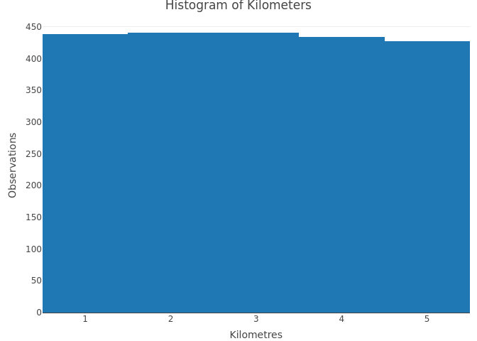
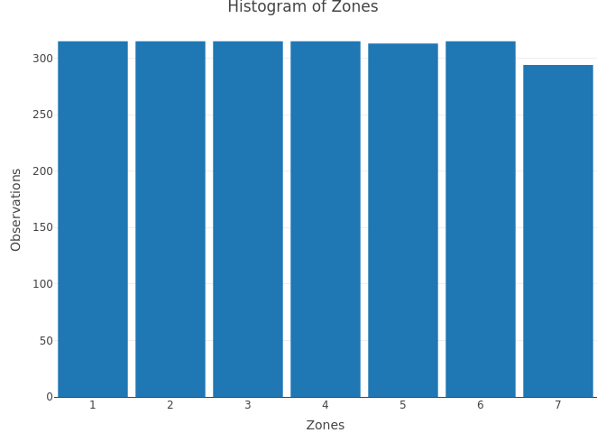
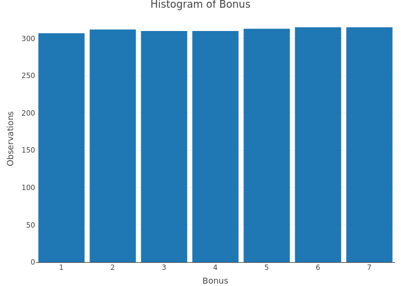
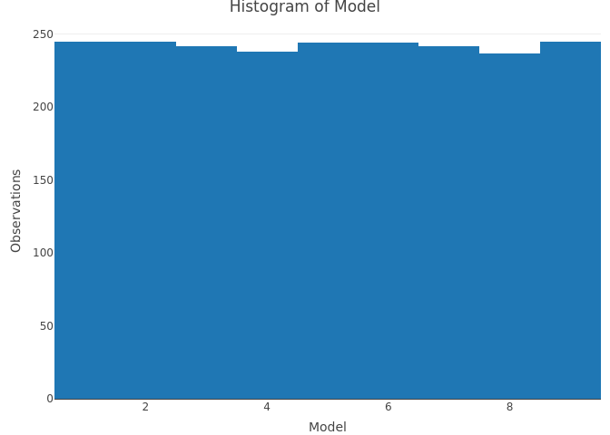
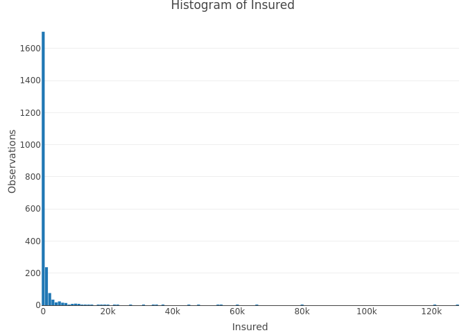
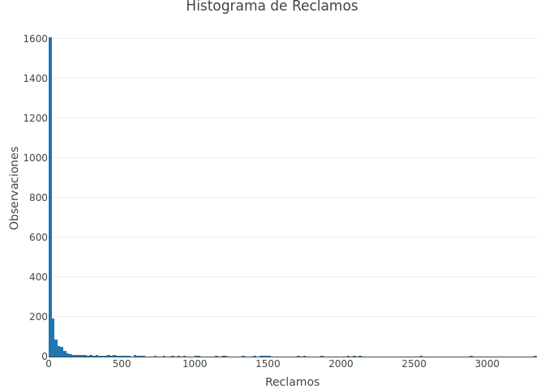
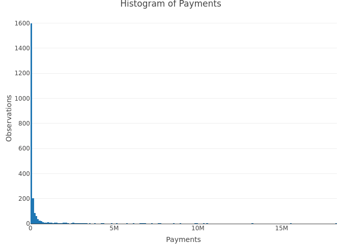

<!-- README.md is generated from README.Rmd. Please edit that file -->

# Project 1. Insurance-Analysis

<!-- badges: start -->
<!-- badges: end -->

## Summary

Claims data were obtained from an insurer in Monterrey. According to the
data obtained it is possible to combine the risks of the insurer’s
portfolio. This report is created as a support for the Risk Committee to
know the structure of the risks as well as as the influence of the
claims with the variables that are known.

## Goals

1.  Descriptive analysis of the variables.
2.  Create categories based on the number of claims, severity, risk,
    etc.
3.  The total value of payments is a fundamental variable for which the
    Committee is interested in knowing if this is a consequence of the
    number of complaints and the number of portfolio years
4.  The Committee wants to find the reasons why the payment increases or
    decreases.Therefore, it is necessary to check if this is a
    consequence of variables such as location,distance etc.
5.  The Committee wants to decide if special fees should be charged
    depending on factors such as location, insured amount, kilometers,
    bonuses, etc.

## Database

    #>   Kilometres Zone Bonus Make Insured Claims Payment
    #> 1          1    1     1    1  455.13    108  392491
    #> 2          1    1     1    2   69.17     19   46221
    #> 3          1    1     1    3   72.88     13   15694
    #> 4          1    1     1    4 1292.39    124  422201
    #> 5          1    1     1    5  191.01     40  119373
    #> 6          1    1     1    6  477.66     57  170913

## 1.-Obtain a visualization that explains with an image the distribution of each of the variables

a)Kilometres

<!-- -->

b)Zones

<!-- -->

c)Bonus

<!-- -->

d)Models

<!-- -->

e)Insured

<!-- -->

f)Claims

<!-- -->

g)Payments

<!-- -->
