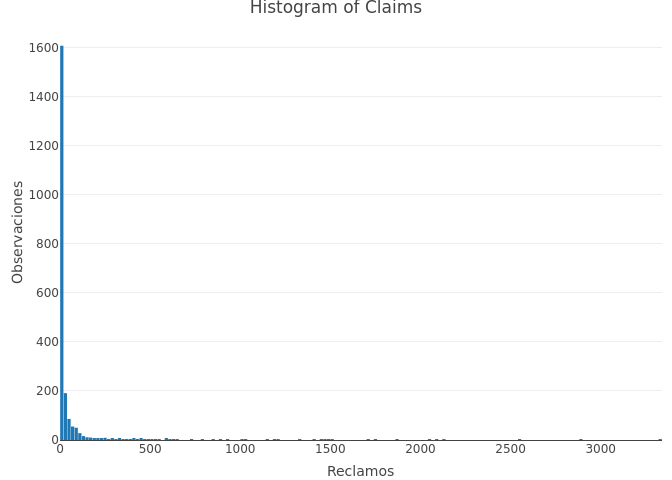
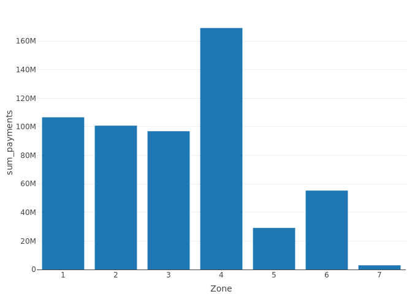
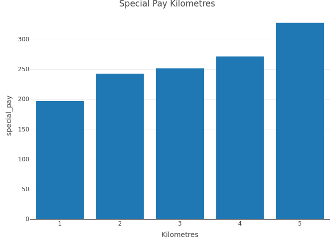

<!-- README.md is generated from README.Rmd. Please edit that file -->

# Project 1. Insurance-Analysis

<!-- badges: start -->
<!-- badges: end -->

## Summary

Claims data were obtained from an insurer in Monterrey. According to the
data obtained it is possible to combine the risks of the insurer’s
portfolio. This report is created as a support for the Risk Committee to
know the structure of the risks as well as as the influence of the
claims with the variables that are known.

## Goals

1.  Descriptive analysis of the variables.
2.  Create categories based on the number of claims, severity, risk,
    etc.
3.  The total value of payments is a fundamental variable for which the
    Committee is interested in knowing if this is a consequence of the
    number of complaints and the number of portfolio years
4.  The Committee wants to find the reasons why the payment increases or
    decreases.Therefore, it is necessary to check if this is a
    consequence of variables such as location,distance etc.
5.  The Committee wants to decide if special fees should be charged
    depending on factors such as location, insured amount, kilometers,
    bonuses, etc.

## Database

    #>   Kilometres Zone Bonus Make Insured Claims Payment
    #> 1          1    1     1    1  455.13    108  392491
    #> 2          1    1     1    2   69.17     19   46221
    #> 3          1    1     1    3   72.88     13   15694
    #> 4          1    1     1    4 1292.39    124  422201
    #> 5          1    1     1    5  191.01     40  119373
    #> 6          1    1     1    6  477.66     57  170913

## 1.-Obtain a visualization that explains with an image the distribution of each of the variables.

a)Kilometres

<!-- -->

b)Zones

<!-- -->

c)Bonus

<!-- -->

d)Models

<!-- -->

e)Insured

<!-- -->

f)Claims

<!-- -->

g)Payments

<!-- --> ## 2.-Create
categories based on the number of claims, severity, risk etc.

1.  Kilometres

<!-- --><!-- --><!-- -->
b) Zones

<!-- --><!-- --><!-- -->

3.  Model

<!-- --><!-- --><!-- -->

## 3.-The total value of payments is a fundamental variable for which the Committee is interested in knowing

## if this is a consequence of the number of claims and the number of years in the portfolio.

1.  corr graph all variables

<!-- -->

    #>            Kilometres  Zone Bonus  Make Insured Claims Payment
    #> Kilometres       1.00 -0.01  0.01  0.00   -0.11  -0.13   -0.12
    #> Zone            -0.01  1.00  0.01 -0.01   -0.06  -0.11   -0.10
    #> Bonus            0.01  0.01  1.00  0.00    0.17   0.11    0.12
    #> Make             0.00 -0.01  0.00  1.00    0.19   0.25    0.24
    #> Insured         -0.11 -0.06  0.17  0.19    1.00   0.91    0.93
    #> Claims          -0.13 -0.11  0.11  0.25    0.91   1.00    1.00

<!-- -->

2.  Scatterplot - Claims

<!-- -->

3.  Scatterplot - Insured

<!-- -->

##4.-The Committee wants to find the variables that cause the payment to
increase or decrease. ##Therefore it is necessary to check if this is a
consequence of variables such as location, distance, etc.

It is necessary to perform a regression to find which variables are the
most relevant (p test).

    #> 
    #> Call:
    #> lm(formula = Payment ~ ., data = insur)
    #> 
    #> Residuals:
    #>     Min      1Q  Median      3Q     Max 
    #> -806775  -16943   -6321   11528  847015 
    #> 
    #> Coefficients:
    #>               Estimate Std. Error t value Pr(>|t|)    
    #> (Intercept) -2.173e+04  6.338e+03  -3.429 0.000617 ***
    #> Kilometres   4.769e+03  1.086e+03   4.392 1.18e-05 ***
    #> Zone         2.323e+03  7.735e+02   3.003 0.002703 ** 
    #> Bonus        1.183e+03  7.737e+02   1.529 0.126462    
    #> Make        -7.543e+02  6.107e+02  -1.235 0.216917    
    #> Insured      2.788e+01  6.652e-01  41.913  < 2e-16 ***
    #> Claims       4.316e+03  1.895e+01 227.793  < 2e-16 ***
    #> ---
    #> Signif. codes:  0 '***' 0.001 '**' 0.01 '*' 0.05 '.' 0.1 ' ' 1
    #> 
    #> Residual standard error: 70830 on 2175 degrees of freedom
    #> Multiple R-squared:  0.9952, Adjusted R-squared:  0.9952 
    #> F-statistic: 7.462e+04 on 6 and 2175 DF,  p-value: < 2.2e-16

View payments and payment averages by: a) Insured b) Claims c)
Kilometres

    #> 
    #> Call:
    #> lm(formula = Payment ~ Claims, data = insur)
    #> 
    #> Residuals:
    #>      Min       1Q   Median       3Q      Max 
    #> -1744858    -8545     2773    13386  1491369 
    #> 
    #> Coefficients:
    #>             Estimate Std. Error t value Pr(>|t|)    
    #> (Intercept) -3362.29    2154.79   -1.56    0.119    
    #> Claims       5020.08      10.35  485.11   <2e-16 ***
    #> ---
    #> Signif. codes:  0 '***' 0.001 '**' 0.01 '*' 0.05 '.' 0.1 ' ' 1
    #> 
    #> Residual standard error: 97480 on 2180 degrees of freedom
    #> Multiple R-squared:  0.9908, Adjusted R-squared:  0.9908 
    #> F-statistic: 2.353e+05 on 1 and 2180 DF,  p-value: < 2.2e-16

<!-- -->

    #> 
    #> Call:
    #> lm(formula = Payment ~ Insured, data = insur)
    #> 
    #> Residuals:
    #>      Min       1Q   Median       3Q      Max 
    #> -5946157   -75828   -70260   -30246  5343552 
    #> 
    #> Coefficients:
    #>              Estimate Std. Error t value Pr(>|t|)    
    #> (Intercept) 73852.388   7971.250   9.265   <2e-16 ***
    #> Insured       167.695      1.383 121.266   <2e-16 ***
    #> ---
    #> Signif. codes:  0 '***' 0.001 '**' 0.01 '*' 0.05 '.' 0.1 ' ' 1
    #> 
    #> Residual standard error: 365600 on 2180 degrees of freedom
    #> Multiple R-squared:  0.8709, Adjusted R-squared:  0.8708 
    #> F-statistic: 1.471e+04 on 1 and 2180 DF,  p-value: < 2.2e-16

<!-- -->

    #> 
    #> Call:
    #> lm(formula = Payment ~ Claims, data = insur)
    #> 
    #> Residuals:
    #>      Min       1Q   Median       3Q      Max 
    #> -1744858    -8545     2773    13386  1491369 
    #> 
    #> Coefficients:
    #>             Estimate Std. Error t value Pr(>|t|)    
    #> (Intercept) -3362.29    2154.79   -1.56    0.119    
    #> Claims       5020.08      10.35  485.11   <2e-16 ***
    #> ---
    #> Signif. codes:  0 '***' 0.001 '**' 0.01 '*' 0.05 '.' 0.1 ' ' 1
    #> 
    #> Residual standard error: 97480 on 2180 degrees of freedom
    #> Multiple R-squared:  0.9908, Adjusted R-squared:  0.9908 
    #> F-statistic: 2.353e+05 on 1 and 2180 DF,  p-value: < 2.2e-16

<!-- -->

## 5.-Finally the Committee wants to decide if fees should be charged

## depending on factors such as location, amount insured,

## miles, bonuses etc. so we need to know the cost of insure a certain risk per year.

## For that they must calculate sum(payments)/sum(insured)=cost of the risk. for each of the

## following categories:

a)Special Pay Zone

<!-- -->

b)Special Pay Kilometres

<!-- -->

c)Special Pay Bonus

<!-- -->
